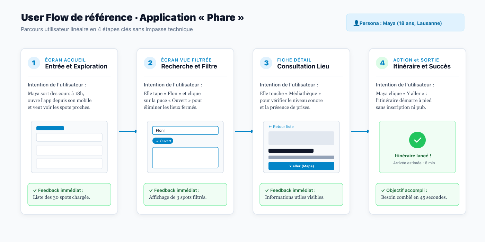

# Exemple de Référence : Pitch d'Intention & Définition du Persona

**Module ICT 291 · Développer des interfaces utilisateurs (UI)**  
Projet témoin d'application : **« Phare »** (Découverte de tiers-lieux d'étude calmes en Suisse romande).

---

## 1. Le Pitch d'Intention Fondateur (Le problème, la solution, la promesse)

> **Pour qui :**  
> Les apprentis, apprenties et personnes en formation professionnelle à Lausanne qui finissent leur journée après 17h30 et cherchent un lieu propice à la concentration.
>
> **Quel besoin réel non satisfait :**  
> Les bibliothèques publiques ferment souvent tôt, les cafés du centre sont saturés ou bruyants, et aucune plateforme n'indique clairement si un espace dispose de prises électriques libres et d'une connexion Wi-Fi stable sans imposer une consommation coûteuse.
>
> **La réponse ergonomique de l'application (« Phare ») :**  
> Une interface web ultra-légère accessible sur smartphone à une main, qui affiche instantanément les spots calmes encore ouverts autour de soi, sans création de compte, sans publicité et avec un statut d'ouverture vérifiable en 3 secondes.

---

## 2. Définition Complète du Persona de Référence

| Dimension | Détail du profil pour « Maya Morel » |
| :--- | :--- |
| **Identité & Âge** | **Maya Morel**, 18 ans, apprentie médiamaticienne CFC de 3e année à l'ETML (Lausanne). |
| **Contexte de vie & Mobilité** | Habite en colocation sans bureau isolé à Renens. Termine son stage en agence à 18h au Flon. Se déplace exclusivement en transports publics (m1 / bus tl). |
| **Environnement matériel** | Smartphone d'occasion (écran 390 px) avec forfait data limité. Utilise son téléphone d'une seule main, sac sur l'épaule ou debout dans le métro. |
| **Objectif principal** | Trouver en moins de 60 secondes un endroit calme, gratuit ou accessible, avec Wi-Fi et prise de courant pour travailler son projet M291 pendant 1h30 avant de rentrer. |
| **Frustrations & Irritants majeurs** | Les sites qui exigent de créer un compte avec mot de passe pour lire une adresse, les popups de cookies invasifs, les filtres cachés sous 4 menus et les statuts « Ouvert » qui ne sont pas à jour. |
| **Sa phrase totem** | *« Si l'application me force à créer un compte juste pour savoir si la médiathèque est ouverte, je ferme l'onglet et je vais ailleurs. »* |
| **Règles de conception déduites** | 1. Les 30 spots doivent se charger sans barrière d'authentification. 2. Les informations vitales (*Ouvert/Fermé*, *Niveau sonore*, *Prises*) doivent être écrites en toutes lettres sur la carte. 3. Les boutons d'action doivent mesurer au minimum 48 × 48 px pour un clic facile au pouce. |

---

## 3. Visualisation du Parcours Utilisateur Associé

*Figure : Trajectoire complète en 4 étapes de Maya, de l'ouverture de l'application à l'activation de l'itinéraire.*
